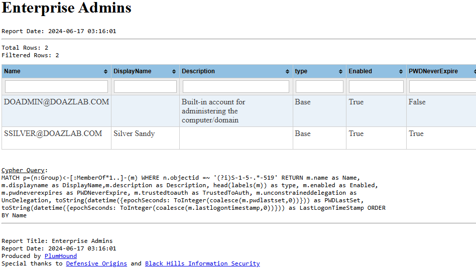
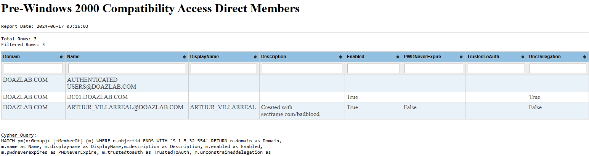
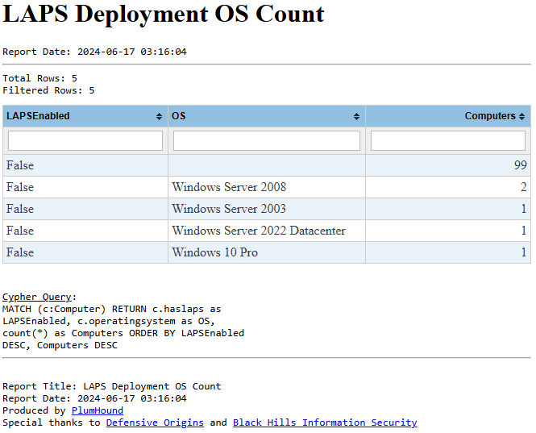
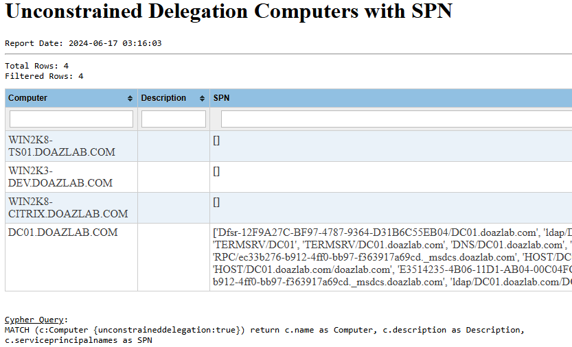
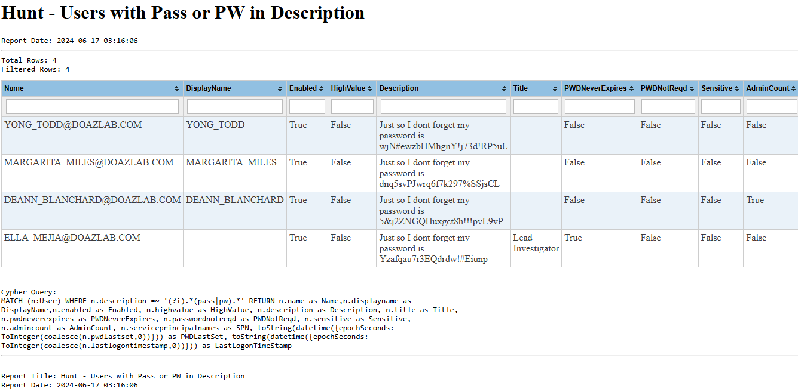
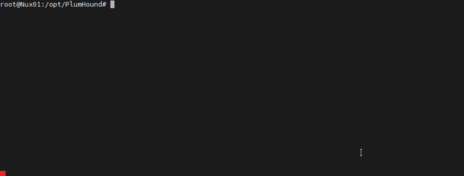

# PlumHound - BloodHoundAD Report Engine for Security Teams
Released as Proof of Concept for Blue and Purple teams to more effectively use BloodHoundAD in continual security life-cycles by utilizing the BloodHoundAD pathfinding engine to identify Active Directory security vulnerabilities resulting from business operations, procedures, policies and legacy service operations.

PlumHound operates by wrapping BloodHoundAD's powerhouse graphical Neo4J backend cypher queries into operations-consumable reports.  Analyzing the output of PlumHound can steer security teams in identifying and hardening common Active Directory configuration vulnerabilities and oversights.

<!-- Start Document Outline -->

* [Release and call to Action](#release-and-call-to-action)
* [Background](#background)
* [Sample Reports](#sample-reports)
* [PlumHound Examples](#plumhound-examples)
	* [Default Task List and Default Credentials](#default-task-list-and-default-credentials)
	* [Default Task List, Specified Neo4j Server and Quiet Output](#default-task-list-specified-neo4j-server-and-quiet-output)
	* [Path Analyzer (BlueHound Module)](#path-analyzer-bluehound-module)
		* [Option #1](#option-1)
		* [Option #2](#option-2)
	* [Busiest Path (BlueHound Module)](#busiest-path-bluehound-module)
		* [Busiest Shortest Path to DA](#busiest-shortest-path-to-da)
		* [Busiest All Path to DA](#busiest-all-path-to-da)
	* [Detailed PlumHound Syntax](#detailed-plumhound-syntax)
* [Database Connection](#database-connection)
* [HTML Report Design Output and Variables](#html-report-design-output-and-variables)
* [TaskList Files](#tasklist-files)
	* [TaskList File Syntax](#tasklist-file-syntax)
	* [TaskList Sample: default.tasks](#tasklist-sample-defaulttasks)
* [Execution Modes](#execution-modes)
	* [Tasks Mode](#tasks-mode)
	* [Single Query Mode](#single-query-mode)
		* [Single Query with Standard Output (Normal Verbosity)](#single-query-with-standard-output-normal-verbosity)
		* [Single Query with Standard Output (Quiet)](#single-query-with-standard-output-quiet)
	* [Busiest Path (BlueHound Module)](#busiest-path-bluehound-module-1)
	* [Analyze Path (BlueHound Module)](#analyze-path-bluehound-module)
* [Additional Modules](#additional-modules)
	* [Report Indexer Moodule](#report-indexer-moodule)
		* [Report Indexer Task Syntax](#report-indexer-task-syntax)
* [Logging](#logging)
* [Hat-Tips &amp; Acknowledgments](#hat-tips--acknowledgments)
* [Presentations](#presentations)
* [Installation Requirements](#installation-requirements)
* [Environment Setup Instructions](#environment-setup-instructions)
* [Known Issues](#known-issues)
* [Collaboration](#collaboration)
* [License](#license)
* [Additional Inclusions:](#additional-inclusions)

<!-- End Document Outline -->

## Release and call to Action
The initial PlumHound code was released on May 14th, 2020 during a Black Hills Information Security webcast, A Blue Teams Perspective on Red Team Tools.  The webcast was recorded and is available on YouTube. [A Blue Team's Perspective on Red Team Tools](https://youtu.be/0mIN2OU5hQEs).


The PlumHound Framework yields itself to community involvement in the creation and proliferation of "TaskLists" (work) that can be shared and used across different organizations.  TaskLists contain jobs for PlumHound to do (queries to run, reports to write).  A second PlumHound community repo has been created to allow for the open sharing of TaskLists (see [Plumhound-Tasks](https://github.com/DefensiveOrigins/PlumHound-Tasks))

Looking for more tasks and templates? Checkout [PlumHound-Tasks ](https://github.com/DefensiveOrigins/PlumHound-Tasks)for the community driven marketplace of PlumHound reporting taskslists and report designs

## Background
A client of ours working on hardening their Active Directory infrastructure asked us about vulnerabilities that can be found by using BloodHound.  They had heard of the effectiveness of BloodHoundAD in Red-Team's hands and was told that BloodHound would identify all types of security mis-alignments and mis-configurations in their Active Directory environment.  We helped them through analysis of their BloodHound dataset and it became quickly evident that BloodHoundAD's pathfinding graphical database was not designed for the fast-passed analytical security team accustom to reading reports and action items.  

In fact, one of our cypher queries determined that 96% of their 3000 users had a path to Domain Admin with an average of just 4 steps.  However, that graphical query rendered over 10,000 paths to Domain Admin.  Finding the actual cause of the short-paths to DA wasn't as easy as just loading data into BloodHound or putting Cobalt Strike on Auto-Pilot with BloodHound Navigation.  
Hence, PlumHound was created out of a need to retrieve consumable data from BloodHoundAD's pathfinding engine.  Data that could yield itself to inferring actionable work for security teams to harden their environments.

## Sample Reports
 Sample reports are no longer included within the repository.  However, the default tasks tasklist will produce reports with ease.  Here are a sample of some less-exciting reports generated from a small lab environment.

  

  

  

  

  

 # PlumHound Examples
Use the default username, password, server, and execute the "Easy" task, to test connectivity.  This will output all Active Directory user objects from the Neo4J database.
```shell
python3 PlumHound.py --easy
```
## Default Task List and Default Credentials 
Execute PlumHound with the Default TaskList using Default Credentials (neo4j:neo4jj) and Database.
```shell
python3 PlumHound.py -x tasks/default.tasks
```
## Default Task List, Specified Neo4j Server and Quiet Output
The same, but quiet the output (-v 0), specify the Neo4J server, username, and password instead of using defaults.
```shell
python3 PlumHound.py -x tasks/default.tasks -s "bolt://127.0.0.1:7687" -u "neo4j" -p "neo4jj" -v 0
```

## Path Analyzer (BlueHound Module) 

### Option #1
Using label. The supported labels are `User`, `Group`, `Computer`, `OU` and `GPO`. This function will assume the target group is "DOMAIN ADMINS".

```shell
python3 PlumHound.py -ap user
```
**NOTE:** The above syntax implies you are using the default values for `sever`, `user` and `password` or that you have hard-coded them in the script.  

### Option #2 
specify `start node` and `end node` 
```shell
python3 PlumHound.py -ap "domain users@example.com" "domain admins@example.com"
```
**NOTE:** To use BlueHound Path Analyzer logic you need to get a copy of the Python script from https://github.com/scoubi/BlueHound  

## Busiest Path (BlueHound Module)
The Busiest Path(s) function takes two parameters 

### Busiest Shortest Path to DA
Find the shortest path that give users Domain Admin (top 5)
```
PlumHound.py -bp short 5
```

### Busiest All Path to DA
Find the busiest path irregardless of length (top 5) to give users Domain Admin
```
PlumHound.py -bp all 5
```

-----

## Detailed PlumHound Syntax
```plaintext
usage: PlumHound.py [-h] [-s SERVER] [-u USERNAME] [-p PASSWORD] [--UseEnc]
                    (--easy | -x TASKFILE | -q,--QuerySingle QUERYSINGLE | -bp,--BusiestPath BUSIESTPATH [BUSIESTPATH ...] | -ap,--AnalyzePath ANALYZEPATH [ANALYZEPATH ...])
                    [-t TITLE] [--of OUTFILE] [--op PATH] [--ox {stdout,HTML,CSV}] [--HTMLHeader HTMLHEADER] [--HTMLFooter HTMLFOOTER] [--HTMLCSS HTMLCSS]
                    [-v VERBOSE]

BloodHound Wrapper for Blue/Purple Teams; v01.070a

optional arguments:
  -h, --help            show this help message and exit
  --easy                Test Database Connection, Returns Domain Users to stdout
  -x TASKFILE, --TaskFile TASKFILE
                        Specify a PlumHound TaskList File
  -q,--QuerySingle QUERYSINGLE
                        Specify a Single Cypher Query
  -bp,--BusiestPath BUSIESTPATH [BUSIESTPATH ...]
                        Find the X Shortest Paths that give the most users a path to Domain Admins. Need to specified [short|all] for shortestpath and the
                        number of results. Ex: PlumHound -bp all 3
  -ap,--AnalyzePath ANALYZEPATH [ANALYZEPATH ...]
                        Analyze 'Attack Paths' between two nodes and find which path needs to be remediated to brake the path.

DATABASE:
  -s SERVER, --server SERVER
                        Neo4J Server
  -u USERNAME, --username USERNAME
                        Neo4J Database Useranme
  -p PASSWORD, --password PASSWORD
                        Neo4J Database Password
  --UseEnc              Use encryption when connecting.

OUTPUT:
  Output Options (For single cypher queries only. --These options are ignored when -x or --easy is specified.

  -t TITLE, --title TITLE
                        Report Title for Single Query [HTML,CSV,Latex]
  --of OUTFILE, --OutFile OUTFILE
                        Specify a Single Cypher Query
  --op PATH, --OutPath PATH
                        Specify an Output Path for Reports
  --ox {stdout,HTML,CSV}, --OutFormat {stdout,HTML,CSV}
                        Specify the type of output

HTML:
  Options for HTML Output (For single queries or TaskLists

  --HTMLHeader HTMLHEADER
                        HTML Header (file) of Report
  --HTMLFooter HTMLFOOTER
                        HTML Footer (file) of Report
  --HTMLCSS HTMLCSS     Specify a CSS template for HTML Output

VERBOSESet verbosity:
  -v VERBOSE, --verbose VERBOSE
                        Verbosity 0-1000, 0 = quiet

For more information see https://plumhound.DefensiveOrigins.com
```


# Database Connection
PlumHound needs to connect to the Neo4J graphing database where BloodHoundAD data was loaded.  

```plaintext
DATABASE:
  -s SERVER, --server SERVER
                        Neo4J Server
  -u USERNAME, --username USERNAME
                        Neo4J Database Useranme
  -p PASSWORD, --password PASSWORD
                        Neo4J Database Password
  --UseEnc              Use encryption when connect
```
PlumHound paramters are set by default.  You can override the default by including the argument.

| Argument/Parameter | Default |
|----------|----------|
| SERVER | bolt://localhost:7687 |
| USERNAME | neo4j |
| PASSWORD | neo4jj |


# HTML Report Design Output and Variables
HTML output includes the ability to use HTML Headers, Footers, and CSS to modify the design of the report.  Additionaly, variables can be added to the HTML Header and Footer files that are replaced at runtime. 
```plaintext
HTML:
  Options for HTML Output (For single queries or TaskLists

  --HTMLHeader HTMLHEADER
                        HTML Header (file) of Report
  --HTMLFooter HTMLFOOTER
                        HTML Footer (file) of Report
  --HTMLCSS HTMLCSS     Specify a CSS template for HTML Output
```

| Argument/Parameter | Default  |
|-----------|----------|
| HTMLHeader  | templates/head.html |
| HTMLFooter  | templates/tail.html |
| HTMLCSS  | templates/html.css |


| Variable                | Output                                   |
|-------------------------|------------------------------------------|
| --------PH_TITLE------- | Report Tile from --Title or TaskList/Job |
| --------PH_DATE------- | Python date.today()|

This allows the HTML output to be dynamic and tailored to your specification.


# TaskList Files
The PlumHound Repo includes a sample TaskList that exports some basic BloodHoundAD Cypher queries to an HTML Report.  The included tasks\Default.tasks sample shows the basic syntax of the TaskList files.  The TaskList Files allow PlumHound to be fully scripted with batch jobs after the SharpHound dataset has been imported not BloodHoundAD on Neo4j. 
Looking for more tasks and templates? Checkout [PlumHound-Tasks ](https://github.com/DefensiveOrigins/PlumHound-Tasks)for the community driven marketplace of PlumHound reporting taskslists and report designs.


## TaskList File Syntax
The TaskList file syntax is as follows. Note that any cypher query containing a double quote must be modified to use a single quote instead of double.

```plaintext
["Report Title","[Output-Format]","[Output-File]","[CypherQuery]"]
```

Output-Format options for TaskLists:
* **HTML**: Generates a HTML Report
* **CSV**: Generates a CSV of data
* **HTMLCSV**: Generates both an HTML report and CSV data.  
  * NOTE: DO not include a file-extension in the Output-File paramter.

Additional Modules in TaskLists:
* Report Index: to use the Report-Index module in a TaskList, use CypherQuery "REPORT-INDEX"

## TaskList Sample: default.tasks
The default.tasks file includes multiple tasks that instruct PlumHound to create reports using the specified "HTML" output format, output filename, and specific BloodHoundAD Neo4JS cypher Query. 
See the Tasks mode below in the Execution modes section for additional information. 
```
PlumHound.py -x tasks/default.tasks
```


# Execution Modes

There are multiple execution modes to get PlumHound to do work. 
* Tasks Mode
* Single Query Mode
* BusiestPath Mode (BlueHound Module)
* AnalyzePath Mode (BlueHound Module)

## Tasks Mode
By specifying a task list, PlumHound can be programmed to run multiple cypher queries and export to multiple formats.
For more information on the tasks file, see the section above.


  


## Single Query Mode
This mode allows you to run a single query and export to standard output, HTML, or CSV.

### Single Query with Standard Output (Normal Verbosity)

```
PlumHound.py -q "MATCH (n:User) RETURN n.name, n.displayname LIMIT 10"

       PlumHound 1.4
        For more information: https://github.com/plumhound
        --------------------------------------
        Server: bolt://localhost:7687
        User: neo4j
        Password: *****
        Encryption: False
        Timeout: 300
        --------------------------------------
        Task: Single Query
        Query Title: Adhoc Query
        Query Format: STDOUT
        Query Path: reports//
on 1:
on 1: n.name                    n.displayname
      ------------------------  ----------------
      ASADMIN@ASAZLAB.COM
      KRBTGT@ASAZLAB.COM
      GUEST@ASAZLAB.COM
      DATAANALYST@ASAZLAB.COM   HelpdeskUser
      HELPDESKUSER@ASAZLAB.COM  HelpdeskUser
      FILEADMIN@ASAZLAB.COM     FileServiceAdmin
      CHARLIEADMIN@ASAZLAB.COM  ITAdmin
      ITADMIN@ASAZLAB.COM       ITAdmin
      SSILVER@ASAZLAB.COM       Silver Sandy
on 1:
         Executing Tasks |██████████████████████████████████████████████████| Tasks 1 / 1  in 0.2s (4.40/s)

        Completed 1 of 1 tasks.


```

### Single Query with Standard Output (Quiet)

By turning the verbosity to zero, this can act as a direct Neo4J handler for queries.

```
PlumHound.py -q "MATCH (n:User) RETURN n.name, n.displayname LIMIT 10" -v 0
on 1:
on 1: n.name                    n.displayname
      ------------------------  ----------------
      ASADMIN@ASAZLAB.COM
      KRBTGT@ASAZLAB.COM
      GUEST@ASAZLAB.COM
      DATAANALYST@ASAZLAB.COM   HelpdeskUser
      HELPDESKUSER@ASAZLAB.COM  HelpdeskUser
      FILEADMIN@ASAZLAB.COM     FileServiceAdmin
      CHARLIEADMIN@ASAZLAB.COM  ITAdmin
      ITADMIN@ASAZLAB.COM       ITAdmin
      SSILVER@ASAZLAB.COM       Silver Sandy
on 1:
         Executing Tasks |██████████████████████████████████████████████████| Tasks 1 / 1  in 0.2s (4.33/s)

```

The single query can also be used to generate HTML reports instead of outputting to STDOUT.

```
PlumHound.py -q "MATCH (n:User) RETURN n.name, n.displayname LIMIT 10" --title "Domain Users (Limit 10)" --of "DomainUserstest.html" --op "reports//" --ox HTML
```

## Busiest Path (BlueHound Module)
The Busiest Path(s) function takes two parameters 
1- `all` or `short` either you want to use `shortestpath` or `allshorteshpaths` algorithym. 
2- The number of results you want to return. ex: Top 5

```plaintext
PlumHound.py -bp short 5
[*]Building Task List
[51, 'IT00385@BTV.ORG']
[51, 'IT00346@BTV.ORG']
[50, 'IT01186@BTV.ORG']
[49, 'IT00435@BTV.ORG']
[49, 'IT00333@BTV.ORG']
[*]Tasks Generation Completed
Tasks: []
```


## Analyze Path (BlueHound Module)
The Analyze Path takes either a `label` or a `start node` and `end node` and loop through all the paths finding which relationship(s) need to be broken in order to break the whole path. This is useful when you want to provide your AD Admins with concrete actions they can take in order to improuve your overall AD Security Posture. 

```plaintext
PlumHound.py -ap group
[...]
---------------------------------------------------------------------
Analyzing paths between IT00738@BTV.ORG and DOMAIN ADMINS@BTV.ORG
---------------------------------------------------------------------
Removing the relationship CanRDP between IT00738@BTV.ORG and COMP00886.BTV.ORG breaks the path!
Removing the relationship HasSession between COMP00886.BTV.ORG and EKRITIKOS00681@BTV.ORG breaks the path!
---------------------------------------------------------------------
Analyzing paths between IT00803@BTV.ORG and DOMAIN ADMINS@BTV.ORG
---------------------------------------------------------------------
---------------------------------------------------------------------
Analyzing paths between IT00854@BTV.ORG and DOMAIN ADMINS@BTV.ORG
---------------------------------------------------------------------
---------------------------------------------------------------------
Analyzing paths between IT00870@BTV.ORG and DOMAIN ADMINS@BTV.ORG
---------------------------------------------------------------------
Removing the relationship ExecuteDCOM between IT00870@BTV.ORG and COMP00629.BTV.ORG breaks the path!
Removing the relationship HasSession between COMP00629.BTV.ORG and YWINES00123@BTV.ORG breaks the path!
Removing the relationship MemberOf between YWINES00123@BTV.ORG and HR01256@BTV.ORG breaks the path!
Removing the relationship MemberOf between HR01256@BTV.ORG and IT01085@BTV.ORG breaks the path!
---------------------------------------------------------------------
Analyzing paths between IT00874@BTV.ORG and DOMAIN ADMINS@BTV.ORG
---------------------------------------------------------------------
Removing the relationship AdminTo between IT00874@BTV.ORG and COMP01055.BTV.ORG breaks the path!
Removing the relationship HasSession between COMP01055.BTV.ORG and LJARAD00311@BTV.ORG breaks the path!
Removing the relationship MemberOf between LJARAD00311@BTV.ORG and HR00694@BTV.ORG breaks the path!
Removing the relationship MemberOf between HR00694@BTV.ORG and IT01182@BTV.ORG breaks the path!
Removing the relationship AdminTo between IT01182@BTV.ORG and COMP00658.BTV.ORG breaks the path!
Removing the relationship AllowedToDelegate between COMP00658.BTV.ORG and COMP01387.BTV.ORG breaks the path!
Removing the relationship AllowedToDelegate between COMP01387.BTV.ORG and COMP00275.BTV.ORG breaks the path!
Removing the relationship HasSession between COMP00275.BTV.ORG and RHETZLER01120@BTV.ORG breaks the path!
Removing the relationship MemberOf between RHETZLER01120@BTV.ORG and DOMAIN ADMINS@BTV.ORG breaks the path!
---------------------------------------------------------------------
Analyzing paths between IT00487@BTV.ORG and DOMAIN ADMINS@BTV.ORG
---------------------------------------------------------------------
---------------------------------------------------------------------
Analyzing paths between IT00547@BTV.ORG and DOMAIN ADMINS@BTV.ORG
---------------------------------------------------------------------
[...]
```

----

# Additional Modules
Additional modules will be documented here. 

## Report Indexer Moodule
The report indexer builds an HTML report of all the completed jobs.  Add the following job to a task list.
The parameter = "REPORT-INDEX" instructs PlumHound to generate an HTML index of all the successfully exported tasks in that run of tasks. 

### Report Indexer Task Syntax

```
["Report Index","HTML","Reports.html","REPORT-INDEX"]
```

# Logging
By default, PlumHound generates a log in file log\PlumHound.log  

# Hat-Tips & Acknowledgments
* [Hausec's Cypher Query CheatSheet](https://hausec.com/2019/09/09/bloodhound-cypher-cheatsheet/)  gave us a headstart on some decent pathfinding cypher queries.  | [Git](https://github.com/hausec)
* [SadProcessor's Blue Hands on BloodHound](https://github.com/SadProcessor/WatchDog) gave us a detailed primer on BloodHoundAD's ability to lead a BlueTeam to water. | [Git](https://github.com/SadProcessor).
* Additional work by SadProcessor with [Cypher Dog 3.0](https://github.com/SadProcessor/CypherDog) shows similar POC via utilizing BloodHoundAD's Cypher Queries with a RestAPI endpoint via PowerShell.  PlumHound operates similarly however written in python and designed for stringing multiple queries into consumable reports designed to infer actionable items. 
* [BloodHoundAD](https://github.com/BloodHoundAD/BloodHound): We wouldn't be talking about this at all if it weren't for the original BloodHoundAD work.  BloodHound is developed by @_wald0, @CptJesus, and @harmj0y.
* "Band-aids don't fix dank domains."  [BadBlood](https://github.com/davidprowe/BadBlood) saved us a ton of time building realistic-enough AD domains for testing. @davidprowe  
* [BloodHound from Red to Blue](https://www.youtube.com/watch?v=-HPhJw9K6_Y) - Scoubi- Mathieu Saulnier Mathieu merged his BlueHound project with PlumHound in 2020 as a extension of features.  Mathieu is an active collaborator of PlumHound and the BlueHound path-finding extension.

# Presentations 
* BHIS Webcast: [A Blue Team's Perspective on Red Team Hack Tools](https://www.youtube.com/watch?v=0mIN2OU5hQE)
* Sector Session: [BlueHound Path Destroyer](https://sector.ca/sessions/bhpd-bluehound-path-destroyer/)
* BHIS Blog: [PlumHound Reporting Engine for BloodHoundAD](https://www.blackhillsinfosec.com/plumhound-reporting-engine-for-bloodhoundad/)


# Installation Requirements
```shell
apt-get install python3
pip3 install -r requirements.txt
```

# Environment Setup Instructions
* Install Neo4JS
* Install BloodhoundAD
* Import AD dataset into BloodhoundAD to be parsed
* Use PlumHound to Report 

# Known Issues
- Python 3.10 causes some issues - Updated checker to WARN users if 3.10 is detected.
- Reporting in Window may have some unexpected results. https://github.com/PlumHound/PlumHound/issues/19#issue-750128037

# Collaboration
Help PlumHound grow and be a great tool for Blue and Purple Teams.  We've created the initial proof of concept and are committed to continuing the maturity of PlumHound to leverage the power of BloodHoundAD into continual security improvement processes.  Community involvement is what makes this industry great!  
* [Black Hills Information Security](https://www.blackhillsinfosec.com) - @[BHInfoSecurity](https://twitter.com/BHinfoSecurity) - [Discord](https://discord.gg/J4UJPgG)
* [Defensive Origins](https://www.defensiveorigins.com)   -  [@DefensiveOGs](https://twitter.com/DefensiveOGs) - [Git](https://github.com/DefensiveOrigins) 
* Kent Ickler  -  @[Krelkci](https://twitter.com/Krelkci) - [Git](https://github.com/Relkci)
* Jordan Drysdale -  [@Rev10D](https://twitter.com/Rev10D) - [Git](https://github.com/rev10d)
* Mathieu Saulnier - Scoubi


# License
[GNU GPL3](https://github.com/DefensiveOrigins/PlumHound/blob/master/LICENSE) 

# Additional Inclusions:
* table-sort-js https://github.com/LeeWannacott/table-sort-js provides sorting for HTML reports (in templates/head.html).
